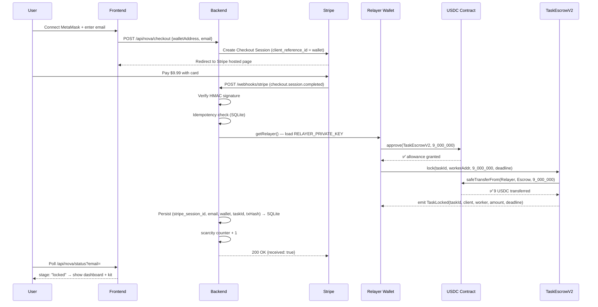
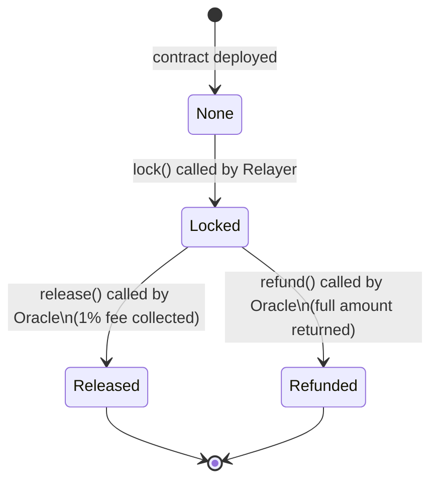

# Zylogen Protocol — Architecture

**Version:** Phase 2 MVP  
**Last Updated:** 2026-04-18  
**Status:** V2 contract written, pending Sepolia deploy

---

## Overview

Zylogen Protocol is a USDC-based settlement layer on Base that converts fiat payments (Stripe) into on-chain escrow locks in a single automated flow. The relayer wallet acts as the on-chain operator: it holds USDC, approves the escrow contract, and calls `lock()` on behalf of the paying client.

---

## Component Diagram

```mermaid
graph TD
    subgraph "Client Browser"
        A[User: MetaMask + Email]
    end

    subgraph "Stripe"
        B[Stripe Checkout]
        C[Stripe Webhook]
    end

    subgraph "Frontend — Vercel (zylogen.xyz)"
        D[Next.js /nova/page.tsx]
        E[/nova/dashboard/page.tsx]
    end

    subgraph "Backend — Railway (Node.js / Express)"
        F[POST /api/nova/checkout]
        G[POST /webhooks/stripe]
        H[paymentRelay.js]
        I[SQLite: nova.db]
        J[GET /api/nova/status]
        K[POST /api/nova/message — novaBrain.js]
    end

    subgraph "Base Mainnet"
        L[USDC Contract\n0x833589...7e]
        M[TaskEscrowV2\nPENDING DEPLOY]
    end

    subgraph "Wallets"
        N[Relayer 0x24A4...D849\nHolds USDC + gas ETH]
        O[Deployer/Treasury 0x8bcB...3693e\nOwns contract, receives fees]
    end

    A -->|1 wallet + email| D
    D -->|2 POST checkout| F
    F -->|3 create session| B
    B -->|4 redirect| A
    A -->|5 pay $9.99| B
    B -->|6 webhook event| G
    G -->|7 verify sig| H
    H -->|8 approve USDC| L
    H -->|9 lock 9 USDC| M
    M -->|10 emit TaskLocked| H
    H -->|11 persist| I
    E -->|12 poll status| J
    J -->|13 read DB| I
    E -->|14 chat| K
    K -->|15 Claude API| K
    N -.->|signs txs 8+9| H
    O -.->|owns V2 contract| M
```

---

## Data Flow — Payment to Escrow Lock



---

## State Machine — Escrow Lifecycle



---

## Smart Contract: TaskEscrowV2

**File:** `contracts/contracts/TaskEscrowV2.sol`  
**Status:** Written + 24/24 tests passing. Not yet deployed.  
**Target:** Base Mainnet + Base Sepolia (testnet first)

| Property | Value |
|----------|-------|
| Token | USDC (ERC-20, 6 decimals) |
| Lock amount | 9,000,000 (= $9.00) |
| Fee | 1% on release (accumulated in contract) |
| Timeout | Caller-specified deadline |
| Oracle | `0x24A400E17d2b9fd9C7eDd99f358A34Fe7751D849` |
| Owner/Treasury | `0x8bcB4935FC0aEAf5733d96a8a72a2Ac79bD3693e` |

**Key functions:**

```solidity
// Client (relayer) locks USDC for a worker
lock(bytes32 taskId, address worker, uint256 amount, uint256 deadline)

// Oracle releases to worker (minus 1% fee accumulated in contract)
release(bytes32 taskId)

// Oracle refunds full amount to client (no fee)
refund(bytes32 taskId)

// Owner withdraws accumulated fees
withdrawFees(address to)
```

**Storage layout (2 slots, gas-optimized):**

```
Slot 0 │ client (160 bits) │ amount (96 bits)                    │
Slot 1 │ worker (160 bits) │ deadline (40 bits) │ status (8 bits) │
```

---

## Backend: Node.js / Express on Railway

**Entry:** `src/index.js`  
**Database:** SQLite (`nova.db`) mapped to Railway `/data` volume  
**Deployment:** Dockerfile at repo root, `npm ci --omit=dev`, `node src/index.js`

### API Routes

| Method | Path | Auth | Description |
|--------|------|------|-------------|
| GET | `/health` | None | Railway health check |
| GET | `/api/nova/scarcity` | None | Founding 100 slots remaining |
| POST | `/api/nova/checkout` | None | Create Stripe Checkout session |
| POST | `/api/nova/message` | DB (email in escrow_records) | Nova AI chat (gated by payment) |
| GET | `/api/nova/status` | None | Check user's escrow stage |
| POST | `/webhooks/stripe` | HMAC sig | Stripe event handler |

### SQLite Schema (relevant tables)

```sql
CREATE TABLE escrow_records (
  stripe_session_id TEXT PRIMARY KEY,
  client_email      TEXT,
  client_wallet     TEXT,
  escrow_id         TEXT,
  amount_cents      INTEGER,
  tx_hash           TEXT,
  status            TEXT  -- pending_wallet | locked | relay_failed | released
);

CREATE TABLE scarcity (
  id      INTEGER PRIMARY KEY,
  total   INTEGER DEFAULT 100,
  claimed INTEGER DEFAULT 0
);
```

---

## Wallets

| Wallet | Address | Role | Chain |
|--------|---------|------|-------|
| Relayer / Oracle | `0x24A400E17d2b9fd9C7eDd99f358A34Fe7751D849` | Signs `approve()` + `lock()`. Set as oracle in V2. | Base Mainnet |
| Deployer / Treasury | `0x8bcB4935FC0aEAf5733d96a8a72a2Ac79bD3693e` | Deploys contracts. Owns V2. Receives fees. | Base Mainnet |

**Wallet segregation is intentional:** Relayer only moves USDC. Deployer/Treasury holds fees and upgrade authority.

---

## Environment Variables

```bash
# Server
PORT=3001

# DB
DB_PATH=/data/nova.db          # Railway volume

# Stripe
STRIPE_SECRET_KEY=sk_live_...
STRIPE_WEBHOOK_SECRET=whsec_...

# Chain
BASE_RPC_URL=https://mainnet.base.org
RELAYER_PRIVATE_KEY=0x...
TASK_ESCROW_ADDRESS=<V2 address — pending deploy>
USDC_ADDRESS=0x833589fCD6eDb6E08f4c7C32D4f71b54bdA02913
USDC_LOCK_AMOUNT=9000000

# AI
ANTHROPIC_API_KEY=sk-ant-...

# Frontend
FRONTEND_URL=https://zylogen.xyz
```

---

## What Is NOT in the MVP

Per the Honest Manifest (see `CLAUDE.md`):

| Feature | Status | Reason |
|---------|--------|--------|
| Privy embedded wallets | Deferred Phase 3 | MetaMask first |
| Gas relayer / paymaster | Deferred Phase 3 | Margin not yet modeled |
| GPT-4o-mini routing | Deferred | Claude Sonnet only |
| Sybil / graph analysis | Deferred | Needs >50 users |
| PostgreSQL | Deferred | SQLite sufficient |
| 24h timelock | Excluded | Contract deployed without it |

---

## V1 Contract (Deprecated)

**Address:** `0x55a8461ad87B5EAD0Fcc6f4474D8FaF32c1a451f`  
**Network:** Base Mainnet  
**Interface:** `lock(bytes32 taskHash, address provider) external payable` — ETH native, not USDC  
**Status:** Proof-of-concept. Not used by V2 pipeline. Do not interact.
